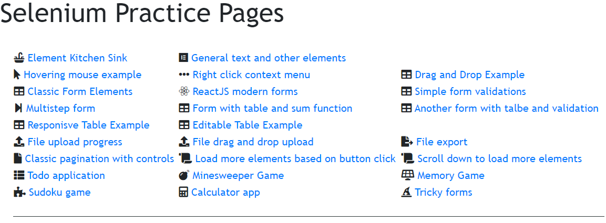

# Selenium Practice Application
This application was created and is shared only to support Training 360 Kft Selenium workshops

## How to run

This is a simple web application. Theoratically it can run in your browser without a web server, but it is more practical and safe to run a web server on your machine.

If the application runs properly you are greeted with a home page:




### Pure docker container 

`cd` into the directory there you checked out the code.

```bash
$ docker build -t t360/selenium-practice .
```

```bash
$ docker run -p '9999:80' t360/selenium-practice 
```

### Docker compose way

`cd` into the directory there you checked out the code.

```bash
$ docker-compose up
```